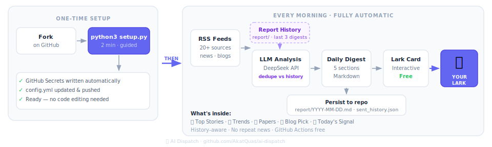

# 📡 AI Dispatch

**Your daily AI intelligence briefing, delivered to Lark (Feishu).**

Automatically aggregates the latest in AI, Robotics, and Agents every morning — analyzed by an LLM of your choice, pushed to Lark as an interactive card. Runs entirely on GitHub Actions. No server. Cheap subscription with [DeepSeek](https://api-docs.deepseek.com/).



---

## What You Get

Every digest contains five structured sections:

| Section                 | Content                                                                          |
| ----------------------- | -------------------------------------------------------------------------------- |
| 📌 Top Stories          | 10–15 curated items, each with significance analysis and cross-story connections |
| 📈 Trend Analysis       | Cross-article patterns with evidence and forward predictions                     |
| 🔬 Papers Worth Reading | Selected arXiv papers with core contributions and reading focus                  |
| 📖 Blog Pick            | One deep-read recommendation (never repeats, auto-deduped)                       |
| 💡 Today's Signal       | The one judgment that matters most today, in one sentence                        |

---

## Quick Start

No terminal required — everything runs in your browser.

### Prerequisites

- GitHub account (free)
- Lark (Feishu) app with `im:message` permission

---

### Step 1 — Fork this repo

Click **Fork** in the top right → create it under your own account.

---

### Step 2 — Run the Setup workflow

Go to **Actions → ⚙️ Setup → Run workflow** and fill in the form:

| Field           | What to enter                                                                  |
| --------------- | ------------------------------------------------------------------------------ |
| Send time (UTC) | hour 0–23 — Beijing 08:00 → `0`, London BST 07:00 → `6`, New York 07:00 → `11` |
| DeepSeek model  | `deepseek-v4-flash` (default), `deepseek-v4-pro`, etc.                         |
| Output language | `English` or `中文`                                                            |

The workflow updates `config.yml` and prints a checklist of the secrets you need to add next.

---

### Step 3 — Add secrets

Go to **Settings → Secrets and variables → Actions → New repository secret**

Add these **4 secrets** (the Setup workflow tells you exactly what to put in each):

| Secret             | Value                                                                                 |
| ------------------ | ------------------------------------------------------------------------------------- |
| `DEEPSEEK_API_KEY` | API key from [platform.deepseek.com/api_keys](https://platform.deepseek.com/api_keys) |
| `LARK_APP_ID`      | App ID from [open.feishu.cn/app](https://open.feishu.cn/app)                          |
| `LARK_SECRET`      | App secret from the same Feishu app                                                   |
| `LARK_RECEIVER`    | Recipient `union_id` (app needs `im:message` permission)                              |

---

### Step 4 — Verify

Go to **Actions → ✅ Check Setup → Run workflow**

```
── GitHub Secrets ──────────────────────────────────
  ✅  DEEPSEEK_API_KEY        (set)
  ✅  LARK_APP_ID             (set)
  ✅  LARK_SECRET             (set)
  ✅  LARK_RECEIVER   (set)

── config.yml ──────────────────────────────────────
  ✅  config.yml found
  ✅  topics configured  (3 topics)
  ✅  news_feeds configured  (9 sources)
  ✅  blog_feeds configured  (8 blogs)

── DeepSeek API ─────────────────────────────────────
  ✅  API connection successful (deepseek-v4-flash)

── Lark ─────────────────────────────────────────────
  ✅  Lark configured
  ✅  Test Lark message sent

══════════════════════════════════════════════════════
  🎉  All checks passed! Your daily digest starts tomorrow.
══════════════════════════════════════════════════════
```

Once all green, AI Dispatch runs automatically every day. The default send time targets **07:00 BST / 07:00 GMT** — change it via `send_hour_utc` in `config.yml`.

---

## Prefer the command line?

<details>
<summary>Set up locally with the interactive wizard (requires Git, Python 3.10+, and GitHub CLI).</summary>

### Step 0 — Install Git and GitHub CLI

#### Install Git

```bash
# macOS — comes pre-installed; if missing:
xcode-select --install
```

```powershell
# Windows
winget install Git.Git
```

```bash
# Linux (Debian / Ubuntu)
sudo apt install git
```

> **Windows:** After `winget` installs Git, **close and reopen your terminal** before continuing.

#### Install GitHub CLI

```bash
# macOS
brew install gh
```

```powershell
# Windows — open a new terminal after this completes
winget install GitHub.cli
```

```bash
# Linux (Debian / Ubuntu)
sudo apt install gh
```

> **Windows:** Same as above — **reopen your terminal** after installation so `gh` is on your PATH.

#### Log in to GitHub

```bash
gh auth login
```

Follow the prompts — select **GitHub.com → HTTPS → Login with a web browser**.

### Step 1 — Fork, clone, and launch

```bash
# macOS / Linux
gh repo fork AkatQuas/ai-dispatch --clone
cd ai-dispatch        # use the folder name printed by gh above
uv sync
uv run python setup.py
```

```powershell
# Windows
gh repo fork AkatQuas/ai-dispatch --clone
cd ai-dispatch        # use the folder name printed by gh above
uv sync
uv run python setup.py
```

> `gh` prints the local path after cloning, e.g. `Cloned fork's Git repository to ai-dispatch`.

The wizard asks a few questions and handles everything else — secrets, config, and push.

### Step 2 — Verify

Go to **Actions → ✅ Check Setup → Run workflow** and confirm all checks pass.

</details>

---

## Cost

GitHub Actions is always free. The only cost is the DeepSeek API call for each daily digest (typically a few cents per run).

| Model                                   | Notes                                                                 |
| --------------------------------------- | --------------------------------------------------------------------- |
| `deepseek-v4-flash` / `deepseek-v4-pro` | Newer V4 models — see [DeepSeek docs](https://api-docs.deepseek.com/) |

Change the model in `config.yml` under `digest.model`, or pass it in the **⚙️ Setup** workflow.

---

## File Structure

```
ai-dispatch/
├── config.yml              ← Your personalization (the only file to edit)
├── setup.py                ← Interactive setup wizard
├── fetch_news.py           ← Main pipeline
├── llm.py                  ← DeepSeek API client
├── check_setup.py          ← Setup verification script
├── pyproject.toml          ← Dependencies (managed with uv)
├── uv.lock
├── requirements.txt        ← Legacy; CI uses uv.lock
├── sent_history.json       ← Auto-maintained dedup log (do not edit manually)
└── .github/workflows/
    ├── daily_news.yml      ← Daily cron job
    ├── setup.yml           ← First-time setup wizard (browser-based)
    └── check_setup.yml     ← One-click setup check
```

---

## FAQ

**Q: Check Setup passed but no daily digest?**
Check Actions → AI Dispatch for errors. GitHub Actions cron can occasionally delay 15–30 minutes.

**Q: Lark message not received?**
Confirm `LARK_RECEIVER` is the recipient's union_id and the app has `im:message` (and send) permissions enabled.

**Q: How do I change the output language?**
Edit `output_language` in `config.yml`. Default is `English` — change it to `中文` for Chinese output. The setup wizard also lets you choose during initial setup.

**Q: How do I add my own RSS sources?**
Add a line under `news_feeds` or `blog_feeds` in `config.yml`: `Source Name: https://rss-url`.

**Q: Blog picks keep repeating?**
`sent_history.json` tracks all previously sent URLs. To reset, clear the `urls` array in that file.

---

---

# 📡 AI Dispatch（中文）

**每天早上，AI 驱动的深度简报，自动聚合分析，推送到 Lark（飞书）。**

全程运行在 GitHub Actions 上，不需要服务器，[极低费用 DeepSeek 订阅](https://api-docs.deepseek.com/zh-cn/)，Fork 即用。

---

## 效果预览

每条简报包含五个固定板块：

| 板块            | 内容                                    |
| --------------- | --------------------------------------- |
| 📌 重点新闻     | 10–15 条精选，每条附意义分析和关联判断  |
| 📈 趋势分析     | 跨文章归纳的行业/技术趋势及预判         |
| 🔬 值得深挖     | 精选 arXiv 论文，说明核心贡献和阅读重点 |
| 📖 今日推荐博客 | 1 篇深度导读，自动去重不重复            |
| 💡 今日信号     | 一句话最关键判断                        |

---

## 快速开始

### 前置条件

- GitHub 账号（免费）
- Lark（飞书）应用，需开通 `im:message` 权限

全程在浏览器完成，无需安装任何软件。

---

### 第一步：Fork 仓库

点击右上角 **Fork** → 创建到你自己的账号下。

---

### 第二步：运行 Setup workflow

进入仓库 → **Actions → ⚙️ Setup → Run workflow**，填写表单：

| 字段            | 填写内容                                                              |
| --------------- | --------------------------------------------------------------------- |
| 发送时间（UTC） | 小时 0–23 — 北京 08:00 → `0`，伦敦 BST 07:00 → `6`，纽约 07:00 → `11` |
| DeepSeek 模型   | `deepseek-v4-flash`（默认）、`deepseek-v4-pro` 等                     |
| 输出语言        | `English` 或 `中文`                                                   |

workflow 运行完成后会自动更新 `config.yml`，并在日志中打印需要添加的 Secrets 清单。

---

### 第三步：添加 Secrets

进入仓库 → **Settings → Secrets and variables → Actions → New repository secret**

按 Setup workflow 日志中的提示，添加以下 **4 个** Secrets：

| Secret 名称        | 填写内容                                                                         |
| ------------------ | -------------------------------------------------------------------------------- |
| `DEEPSEEK_API_KEY` | 在 [platform.deepseek.com/api_keys](https://platform.deepseek.com/api_keys) 申请 |
| `LARK_APP_ID`      | 飞书应用 ID — [open.feishu.cn/app](https://open.feishu.cn/app)                   |
| `LARK_SECRET`      | 飞书应用 Secret                                                                  |
| `LARK_RECEIVER`    | 接收人 `union_id`（应用需 `im:message` 权限）                                    |

---

### 第四步：验证配置

进入仓库 → **Actions → ✅ Check Setup → Run workflow**

```
── GitHub Secrets ──────────────────────────────────
  ✅  DEEPSEEK_API_KEY        (已设置)
  ✅  LARK_APP_ID             (已设置)
  ✅  LARK_SECRET             (已设置)
  ✅  LARK_RECEIVER   (已设置)

── config.yml ──────────────────────────────────────
  ✅  config.yml 存在
  ✅  topics 已配置      (3 个主题)
  ✅  news_feeds 已配置  (9 个来源)
  ✅  blog_feeds 已配置  (8 个博客)

── DeepSeek API ─────────────────────────────────────
  ✅  API 连接成功 (deepseek-v4-flash)

── Lark ─────────────────────────────────────────────
  ✅  Lark 配置完整
  ✅  测试 Lark 消息已发送

══════════════════════════════════════════════════════
  🎉  所有检查通过！查收 Lark 测试消息后即可等待每日简报。
══════════════════════════════════════════════════════
```

全部绿色后每天自动运行，默认目标到达时间为 **BST 07:00 / GMT 07:00**。

---

## 偏好命令行？

<details>
<summary>使用本地交互向导配置（需要 Git、Python 3.10+ 和 GitHub CLI）。</summary>

### 第零步：安装 Git 和 GitHub CLI

#### 安装 Git

```bash
# macOS — 一般已预装；如果没有：
xcode-select --install
```

```powershell
# Windows
winget install Git.Git
```

```bash
# Linux（Debian / Ubuntu）
sudo apt install git
```

> **Windows 注意：** `winget` 安装完后，**关闭终端重新打开**再继续。

#### 安装 GitHub CLI

```bash
# macOS
brew install gh
```

```powershell
# Windows — 安装完成后需要重新打开终端
winget install GitHub.cli
```

```bash
# Linux（Debian / Ubuntu）
sudo apt install gh
```

> **Windows 注意：** 同上，安装后**重新打开终端**，`gh` 才能被识别。

#### 登录 GitHub

```bash
gh auth login
```

按提示选择 **GitHub.com → HTTPS → Login with a web browser**。

### 第一步：Fork、clone 并启动向导

```bash
# macOS / Linux
gh repo fork AkatQuas/ai-dispatch --clone
cd ai-dispatch        # 用 gh 输出的文件夹名，通常就是 ai-dispatch
uv sync
uv run python setup.py
```

```powershell
# Windows
gh repo fork AkatQuas/ai-dispatch --clone
cd ai-dispatch        # 用 gh 输出的文件夹名，通常就是 ai-dispatch
uv sync
uv run python setup.py
```

向导会自动写入所有 Secrets、更新 `config.yml` 并推送。

### 第二步：验证配置

进入仓库 → **Actions → ✅ Check Setup → Run workflow**，确认所有检查通过。

</details>

---

## 费用参考

GitHub Actions 完全免费。唯一成本是每次日报的 DeepSeek API 调用（通常每次几分钱）。

| 模型                                    | 说明                                                           |
| --------------------------------------- | -------------------------------------------------------------- |
| `deepseek-v4-flash` / `deepseek-v4-pro` | V4 新模型 — 见 [DeepSeek 文档](https://api-docs.deepseek.com/) |

在 `config.yml` 的 `digest.model` 中修改模型，或在 **⚙️ Setup** workflow 中指定。

---

## 文件说明

```
ai-dispatch/
├── config.yml              ← 你的个性化配置（唯一需要编辑的文件）
├── setup.py                ← 交互式配置向导
├── fetch_news.py           ← 主程序
├── llm.py                  ← DeepSeek API 客户端
├── check_setup.py          ← 配置验证脚本
├── pyproject.toml          ← 依赖（uv 管理）
├── uv.lock
├── requirements.txt
├── sent_history.json       ← 已推送博客记录（自动维护，请勿手动编辑）
└── .github/workflows/
    ├── daily_news.yml      ← 每日定时任务
    └── check_setup.yml     ← 一键验证配置
```

---

## 常见问题

**Q: Check Setup 通过了但每日简报没来？**
检查 Actions → AI Dispatch 里有没有报错。GitHub Actions 的 cron 有时会延迟 15–30 分钟。

**Q: 收不到 Lark 消息？**
确认 `LARK_RECEIVER` 是接收人的 union_id，且应用已开通 `im:message`（及发送）权限。

**Q: 如何切换输出语言？**
修改 `config.yml` 中的 `output_language` 字段。默认为 `English`，改为 `中文` 即输出中文。配置向导中也可以在初始设置时选择。

**Q: 如何添加自己的 RSS 源？**
在 `config.yml` 的 `news_feeds` 或 `blog_feeds` 下新增一行：`名称: RSS链接`。

**Q: 推荐博客一直重复？**
`sent_history.json` 记录已推送内容，如需重置，清空该文件的 `urls` 数组即可。
