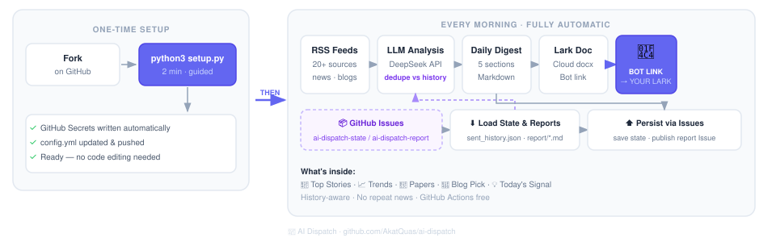

# 📡 AI Dispatch（中文）

**每天早上，AI 驱动的深度简报，自动聚合分析，生成飞书云文档并由机器人推送链接。**



全程运行在 GitHub Actions 上，不需要服务器，[极低费用 DeepSeek 订阅](https://api-docs.deepseek.com/zh-cn/)，Fork 即用。

---

## 效果预览

每条简报包含五个固定板块：

| 板块            | 内容                                    |
| --------------- | --------------------------------------- |
| 📌 重点新闻     | 10–15 条精选，每条附意义分析和关联判断  |
| 📈 趋势分析     | 跨文章归纳的行业/技术趋势及预判         |
| 🔬 值得深挖     | 精选 arXiv 论文，说明核心贡献和阅读重点 |
| 📖 今日推荐博客 | 1 篇深度导读，自动去重不重复            |
| 💡 今日信号     | 一句话最关键判断                        |

---

## 原料流水线（抓取 → 清洗 → 处理）

送入 LLM 之前，RSS 会经过 `ai_dispatch/feed_pipeline.py` 三阶段处理：

| 阶段 | 作用 |
| ---- | ---- |
| **Fetch 抓取** | 并行 HTTP 下载，单源超时 + 全局 QPS 限速（`fetch_max_workers`、`fetch_min_interval_seconds`） |
| **Clean 清洗** | 去 HTML/实体，剥 HN 模板噪声，提取 Radarai「一句话摘要」，summary 为空时回退 `entry.content` |
| **Process 处理** | URL 规范化、标题去重、按 `topics` 打分、按池子上限截断（`news_max_items`、`arxiv_max_items`、`blog_max_items`） |

只有处理后的快照会进入 LLM prompt（也可选存为飞书「原始资料」文档）。日志会显示压缩比，例如 `News pipeline: 180 fetched → 40 for LLM`。

`config.yml` 中 `digest` 段常用参数：

| 参数 | 默认 | 说明 |
| ---- | ---- | ---- |
| `news_max_items` | 40 | 送入 LLM 的新闻上限 |
| `arxiv_max_items` | 30 | 新闻池中保留的 arXiv 论文上限 |
| `blog_max_items` | 25 | 送入 LLM 的博客 RSS 上限 |
| `blog_classics_max` | 3 | 经典/访谈候选上限 |
| `fetch_max_workers` | 3 | 并行抓取 worker 数 |
| `fetch_min_interval_seconds` | 0.5 | 任意两次 HTTP 请求的最小间隔（秒） |
| `hn_min_points` | 5 | HN RSS 最低热度，过滤 Show HN 噪声 |
| `summary_max_chars` | 400 | 单条清洗后摘要上限 |

`news_feeds` 已默认启用 **arXiv**（`cs.AI` / `cs.RO` / `cs.LG`），经 `arxiv_keywords` 过滤后供「值得深挖」板块使用。

---

## 快速开始

### 前置条件

- GitHub 账号（免费）
- Lark（飞书）应用，需开通 `im:message` 和 `docx:document` 权限

全程在浏览器完成，无需安装任何软件。

---

### 第一步：Fork 仓库

点击右上角 **Fork** → 创建到你自己的账号下。

---

### 第二步：运行 Setup workflow

进入仓库 → **Actions → ⚙️ Setup → Run workflow**，填写表单：

| 字段            | 填写内容                                          |
| --------------- | ------------------------------------------------- |
| DeepSeek 模型   | `deepseek-v4-flash`（默认）、`deepseek-v4-pro` 等 |
| 输出语言        | `English` 或 `中文`                               |

workflow 运行完成后会自动更新 `config.yml`，并在日志中打印需要添加的 Secrets 清单。

---

### 第三步：添加 Secrets

进入仓库 → **Settings → Secrets and variables → Actions → New repository secret**

按 Setup workflow 日志中的提示，添加以下 **5 个** Secrets：

| Secret 名称         | 填写内容                                                                         |
| ------------------- | -------------------------------------------------------------------------------- |
| `DEEPSEEK_API_KEY`  | 在 [platform.deepseek.com/api_keys](https://platform.deepseek.com/api_keys) 申请 |
| `LARK_APP_ID`       | 飞书应用 ID — [open.feishu.cn/app](https://open.feishu.cn/app)                   |
| `LARK_SECRET`       | 飞书应用 Secret                                                                  |
| `LARK_FOLDER_TOKEN` | 云文档文件夹 token（见 [docs/lark-doc.md](docs/lark-doc.md)）                    |
| `LARK_RECEIVER`     | 接收人 `union_id`（应用需 `im:message` 权限）                                    |

可选 — [Langfuse](https://langfuse.com) LLM 可观测性（见 [LLM 可观测性](#llm-可观测性langfuse)）：

| Secret 名称            | 填写内容                                                         |
| ---------------------- | ---------------------------------------------------------------- |
| `LANGFUSE_PUBLIC_KEY`  | Langfuse 项目公钥（`pk-lf-...`）                                 |
| `LANGFUSE_SECRET_KEY`  | Langfuse 项目私钥（`sk-lf-...`）                                 |
| `LANGFUSE_BASE_URL`    | 区域地址，如 `https://cloud.langfuse.com` 或 `https://jp.cloud.langfuse.com` |

---

### 第四步：验证配置

进入仓库 → **Actions → ✅ Check Setup → Run workflow**

```
── GitHub Secrets ──────────────────────────────────
  ✅  DEEPSEEK_API_KEY        (已设置)
  ✅  LARK_APP_ID             (已设置)
  ✅  LARK_SECRET             (已设置)
  ✅  LARK_RECEIVER           (已设置)
  ✅  LARK_FOLDER_TOKEN       (已设置)

── config.yml ──────────────────────────────────────
  ✅  config.yml 存在
  ✅  topics 已配置      (3 个主题)
  ✅  news_feeds 已配置  (9 个来源)
  ✅  blog_feeds 已配置  (8 个博客)

── DeepSeek API ─────────────────────────────────────
  ✅  API 连接成功 (deepseek-v4-flash)

── Lark ─────────────────────────────────────────────
  ✅  Lark 配置完整
  ✅  测试 Lark 文档通知已发送

══════════════════════════════════════════════════════
  🎉  所有检查通过！查收 Lark 测试消息后即可等待每日简报。
══════════════════════════════════════════════════════
```

全部绿色后每天自动运行，默认 **UTC 6:00**（约伦敦 07:00 BST）— 发送时间请改 `.github/workflows/daily_news.yml` 中的 cron。

---

## 偏好命令行？

<details>
<summary>使用本地交互向导配置（需要 Git、[uv](https://docs.astral.sh/uv/) 和 GitHub CLI）。</summary>

### 第零步：安装 Git、uv 和 GitHub CLI

#### 安装 uv

```bash
# macOS / Linux
curl -LsSf https://astral.sh/uv/install.sh | sh
```

```powershell
# Windows
powershell -c "irm https://astral.sh/uv/install.ps1 | iex"
```

> **Windows 注意：** 安装后**关闭终端重新打开**，`uv` 才能被识别。

#### 安装 Git

```bash
# macOS — 一般已预装；如果没有：
xcode-select --install
```

```powershell
# Windows
winget install Git.Git
```

```bash
# Linux（Debian / Ubuntu）
sudo apt install git
```

> **Windows 注意：** `winget` 安装完后，**关闭终端重新打开**再继续。

#### 安装 GitHub CLI

```bash
# macOS
brew install gh
```

```powershell
# Windows — 安装完成后需要重新打开终端
winget install GitHub.cli
```

```bash
# Linux（Debian / Ubuntu）
sudo apt install gh
```

> **Windows 注意：** 同上，安装后**重新打开终端**，`gh` 才能被识别。

#### 登录 GitHub

```bash
gh auth login
```

按提示选择 **GitHub.com → HTTPS → Login with a web browser**。

### 第一步：Fork、clone 并启动向导

```bash
# macOS / Linux
gh repo fork AkatQuas/ai-dispatch --clone
cd ai-dispatch        # 用 gh 输出的文件夹名，通常就是 ai-dispatch
uv sync
uv run python setup.py
```

```powershell
# Windows
gh repo fork AkatQuas/ai-dispatch --clone
cd ai-dispatch        # 用 gh 输出的文件夹名，通常就是 ai-dispatch
uv sync
uv run python setup.py
```

向导会自动写入所有 Secrets、更新 `config.yml` 并推送。

### 第二步：验证配置

进入仓库 → **Actions → ✅ Check Setup → Run workflow**，确认所有检查通过。

</details>

---

## 费用参考

GitHub Actions 完全免费。唯一成本是每次日报的 DeepSeek API 调用（通常每次几分钱）。

| 模型                                    | 说明                                                           |
| --------------------------------------- | -------------------------------------------------------------- |
| `deepseek-v4-flash` / `deepseek-v4-pro` | V4 新模型 — 见 [DeepSeek 文档](https://api-docs.deepseek.com/) |

在 `config.yml` 的 `digest.model` 中修改模型，或在 **⚙️ Setup** workflow 中指定。

---

## 本地开发

依赖由 [uv](https://docs.astral.sh/uv/) 管理（`pyproject.toml` + `uv.lock`）。CI 使用 `uv sync --frozen` 安装。

```bash
cd ai-dispatch
uv sync                              # 创建 .venv 并安装锁定依赖
uv sync --group dev                  # 含 ruff + pre-commit
uv run python setup.py               # 交互式首次配置
uv run python -m unittest discover -s tests -v
uv run python check_setup.py             # 完整配置检查（需要 .env 中的密钥）
```

**代码检查与格式化（[Ruff](https://docs.astral.sh/ruff/)）：**

```bash
uv run ruff check .                  # 静态检查
uv run ruff check --fix .            # 自动修复
uv run ruff format .                 # 格式化
uv run ruff format --check .         # CI：仅检查格式
```

**Git pre-commit（推荐）：**

```bash
uv sync --group dev
uv run pre-commit install            # 每台机器执行一次
uv run pre-commit run --all-files    # 手动全量跑一遍
```

每次 `git commit` 会自动执行：尾随空格/EOF、YAML 检查、Ruff lint（含 `--fix`）与 format。配置见 [`.pre-commit-config.yaml`](./.pre-commit-config.yaml)。CI 在 **Lint & Format** workflow 中对齐相同检查。

VS Code/Cursor：安装 [Ruff 扩展](https://marketplace.visualstudio.com/items?itemName=charliermarsh.ruff)；[`.vscode/settings.json`](./.vscode/settings.json) 已配置保存时格式化。

**CLI 入口：**

| 命令 | 说明 |
| ---- | ---- |
| `uv run ai-dispatch` | 抓取、汇总并发送每日简报 |
| `uv run python check_setup.py` | 验证密钥、API 与 Lark |
| `uv run ai-dispatch-issues` | 管理 GitHub Issue 状态（`load` / `save` / …） |

---

## LLM 可观测性（Langfuse）

本项目集成了 [Langfuse](https://langfuse.com) 作为 **可选** 的 LLM 观测层。对每日简报这种「黑盒」调用来说，Langfuse 能帮你回答：模型收到了什么、回了什么、花了多少 token、多轮推理卡在哪一轮。

当 `LANGFUSE_PUBLIC_KEY` 与 `LANGFUSE_SECRET_KEY` 同时配置时，会自动记录：

- **`complete()` / `ping()` 的 trace** — 输入 prompt、输出正文
- **多轮 generation 嵌套** — thinking 模型需要续写时，每轮单独可见
- **分层 trace 结构** — `summarize-digest` → `deepseek-complete` → `deepseek-round-N-{initial|reasoning|truncation}` → `deepseek-generation-N-*`
- **模型名、token、费用** — 便于对比 `deepseek-v4-flash` / `pro` 或排查异常消耗
- **标签** `ai-dispatch` — 在 Langfuse 控制台按项目筛选

任一 key 未设置则 **完全跳过上报**，不影响正常运行。

**本地启用** — 写入 `.env`（参考 [`.env.example`](./.env.example)）：

```bash
LANGFUSE_PUBLIC_KEY=pk-lf-...
LANGFUSE_SECRET_KEY=sk-lf-...
LANGFUSE_BASE_URL=https://cloud.langfuse.com   # 或 https://jp.cloud.langfuse.com 等
```

**CI 启用** — 在 GitHub Actions Secrets 中配置同名变量；`uv run python setup.py` 向导也会询问是否写入。Workflow 已把变量传给 LLM 相关步骤。

在 [langfuse.com/cloud](https://langfuse.com/cloud) 免费注册项目 → **Settings → API Keys** 获取密钥。

---

## 文件说明

```
ai-dispatch/
├── config.yml              ← 你的个性化配置（唯一需要编辑的文件）
├── setup.py                ← 交互式配置向导
├── check_setup.py          ← 配置验证（辅助脚本）
├── ai_dispatch/            ← 应用库（单层 package）
│   ├── fetch_news.py       ← 主编排：抓取 → 总结 → 飞书
│   ├── feed_pipeline.py    ← RSS 抓取 · 清洗 · 去重 · 打分 · 截断
│   ├── issue_store.py      ← 通过 GitHub Issues 持久化状态与报告
│   ├── llm.py              ← DeepSeek API 客户端
│   ├── langfuse_tracing.py ← 可选 Langfuse 追踪
│   ├── lark_doc.py         ← 飞书云文档创建 + markdown 写入
│   ├── lark_notify.py      ← 文档报告 + 机器人链接通知
│   ├── send_lark_message.py← 飞书机器人消息发送
│   └── paths.py            ← 项目根路径
├── tests/
│   ├── test_feed_pipeline.py
│   ├── test_fetch_news.py
│   └── test_llm.py
├── scripts/
│   └── smoke_test.py       ← pre-commit / CI 冒烟测试
├── .pre-commit-config.yaml
├── pyproject.toml          ← 依赖（uv 管理）
├── uv.lock
└── .github/workflows/
    ├── daily_news.yml      ← 每日定时任务
    ├── lint.yml            ← Ruff 检查 / 格式化 / 冒烟测试
    ├── setup.yml           ← 首次配置向导（浏览器版）
    └── check_setup.yml     ← 一键验证配置
```

运行时文件（`sent_history.json`、`report/*.md`）已 gitignore，由 Issues（`ai-dispatch-state` / `ai-dispatch-report`）持久化。每次 CI 流程：① `load` 拉取状态和最近报告 → ② 抓取/分析/推送 → ③ `save` + `publish-today` 写回。

---

## 常见问题

**Q: Check Setup 通过了但每日简报没来？**
检查 Actions → AI Dispatch 里有没有报错。GitHub Actions 的 cron 有时会延迟 15–30 分钟。

**Q: 收不到 Lark 消息？**
确认 `LARK_RECEIVER` 是接收人的 union_id，`LARK_FOLDER_TOKEN` 已设置，且应用已开通 `im:message` 和 `docx:document` 权限。

**Q: 如何切换输出语言？**
修改 `config.yml` 中的 `output_language` 字段。默认为 `English`，改为 `中文` 即输出中文。配置向导中也可以在初始设置时选择。

**Q: 如何添加自己的 RSS 源？**
在 `config.yml` 的 `news_feeds` 或 `blog_feeds` 下新增一行：`名称: RSS链接`。

**Q: 推荐博客一直重复？**
去重状态在 label 为 `ai-dispatch-state` 的 Issue 中。清空其中 `urls` 数组（或改本地 `sent_history.json` 后执行 `uv run ai-dispatch-issues save`）。
